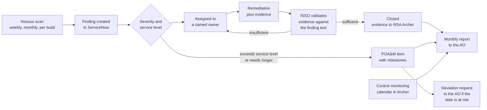

# Keystone Grants Management System (KGMS): Continuous Monitoring and Vulnerability Management
### Tenable Nessus, ServiceNow and RSA Archer, applied to one simulated federal system

> ### PORTFOLIO EXERCISE, SIMULATED SYSTEM
> **Keystone Grants Management System (KGMS) does not exist.** The Federal Workforce Development Agency (FWDA) is a fictional federal
> agency invented for this portfolio. Every organisation, person, system
> identifier, network address, finding, date and signature on this page is
> fabricated for training purposes. Nothing here is drawn from any real
> employer, client or government system, and no real document, artifact or
> data has been reproduced. This file is coursework, not a government record.

---

## Why this repository exists

Getting a system authorised is a project. Keeping it authorised is a job, and it is the
job most Governance, Risk and Compliance analysts actually do every day. This repository
is that work: the scanning programme, the remediation workflow, the control monitoring
model, the assessment procedures, and the reporting that goes to the person who signed
the authorisation.

Plain language version: the first two repositories are about getting the building
inspected and approved. This one is about the years afterwards, when somebody has to keep
checking the fire doors, chase the contractor who has not fixed the broken one, and send
an honest monthly report to the person whose signature is on the certificate.

The three tools here are the ones this work is genuinely done in:

- **Tenable Nessus** finds known weaknesses in the system by scanning it.
- **ServiceNow** is where remediation work is assigned, tracked and evidenced.
- **RSA Archer** is where controls, evidence and assessment results are held so that
  somebody can answer "prove this control worked all year" without a search.

---

## Contents

| Module | Document | Primary reference |
|---|---|---|
| [CM-01](cm-01-conmon-strategy/README.md) | Continuous Monitoring Strategy: what is monitored, how often, and why that frequency | NIST SP 800-137 |
| [CM-02](cm-02-vulnerability-management/README.md) | Vulnerability Management Programme: scan design, CVSS handling, service levels, August 2026 findings | NIST SP 800-40 Rev 4, RA-5, SI-2 |
| [CM-03](cm-03-poam-lifecycle-servicenow/README.md) | POA&M Lifecycle in ServiceNow: states, assignment, evidence validation, deviation requests | NIST SP 800-37 Rev 2, OMB A-130 |
| [CM-04](cm-04-archer-control-monitoring/README.md) | Control Monitoring in RSA Archer: control library, evidence repository, monitoring calendar | NIST SP 800-53 Rev 5, CA-7 |
| [CM-05](cm-05-security-control-assessment/README.md) | Security Control Assessment Procedures: objectives, methods, objects, worked test cases | NIST SP 800-53A Rev 5 |
| [CM-06](cm-06-metrics-reporting/README.md) | Metrics and Reporting: what to measure, what not to, and the monthly report to the AO | NIST SP 800-55, SP 800-137 |

### Machine readable artifacts

| File | What it is |
|---|---|
| [artifacts/kgms-vulnerability-findings-2026-08.csv](artifacts/kgms-vulnerability-findings-2026-08.csv) | The August 2026 scan finding set with service level status |
| [artifacts/kgms-control-test-cases.csv](artifacts/kgms-control-test-cases.csv) | Assessment test cases with objectives, methods and expected results |
| [artifacts/kgms-conmon-calendar.csv](artifacts/kgms-conmon-calendar.csv) | The monitoring calendar: every activity, frequency, owner and deliverable |

---

## The monitoring loop

---

## The simulated system, in brief

| Field | Detail |
|---|---|
| System | Keystone Grants Management System (KGMS) |
| Identifier | `FWDA-KGMS-2026-MOD` |
| Operator | Federal Workforce Development Agency (FWDA), fictional |
| Authorisation | FedRAMP Moderate agency ATO, granted 15 May 2026, expires 14 May 2029 |
| Components monitored | 11 compute instances, 4 managed database instances, 3 object stores, 3 container images, 7 log groups |
| Reporting period shown | July and August 2026 |

Full system detail, the authorisation package and the assessment that produced the
original finding set are in
[keystone-kgms-fedramp-rmf](https://github.com/Nkee07/keystone-kgms-fedramp-rmf).

---

## August 2026 position at a glance

| Measure | Value |
|---|---|
| Vulnerability findings in the August scan cycle | 10 |
| Critical | 3 |
| High | 4 |
| Moderate | 2 |
| Low | 1 |
| Closed within service level | 4 |
| Open and inside service level | 6 |
| Open and past service level | 0 |
| POA&M items open at 31 July 2026 | 8 |

---

## Related repositories

| Repository | What it covers |
|---|---|
| [keystone-kgms-fedramp-rmf](https://github.com/Nkee07/keystone-kgms-fedramp-rmf) | The federal authorisation: RMF Steps 0 to 6, 16 assessment findings, the 10 item POA&M and the ATO memorandum |
| [keystone-kgms-iso27001](https://github.com/Nkee07/keystone-kgms-iso27001) | The same system under ISO/IEC 27001:2022 and ISO/IEC 27005, with a framework crosswalk |

---

## About the author

**Nkeiru Sarah Adesida**
Cybersecurity Governance, Risk and Compliance analyst. Certified Information Systems
Auditor (CISA), CompTIA Security+, Master of Science in Cybersecurity Management and
Policy, University of Maryland Global Campus.

Working areas: NIST Risk Management Framework, security control assessment, risk
assessment, POA&M management, continuous monitoring, and vulnerability management with
Tenable Nessus, ServiceNow and RSA Archer.

[GitHub](https://github.com/Nkee07) | [LinkedIn](https://www.linkedin.com/in/nkeiru-adesida-grc)

---

*Author: Nkeiru Sarah Adesida, Information System Security Officer (ISSO), portfolio scenario*  
*Simulated system: Keystone Grants Management System (KGMS) | FWDA-KGMS-2026-MOD*  
*This document is a portfolio exercise built on a fictional organisation. It is not a government record.*  
*[GitHub portfolio](https://github.com/Nkee07) | [LinkedIn](https://www.linkedin.com/in/nkeiru-adesida-grc)*
