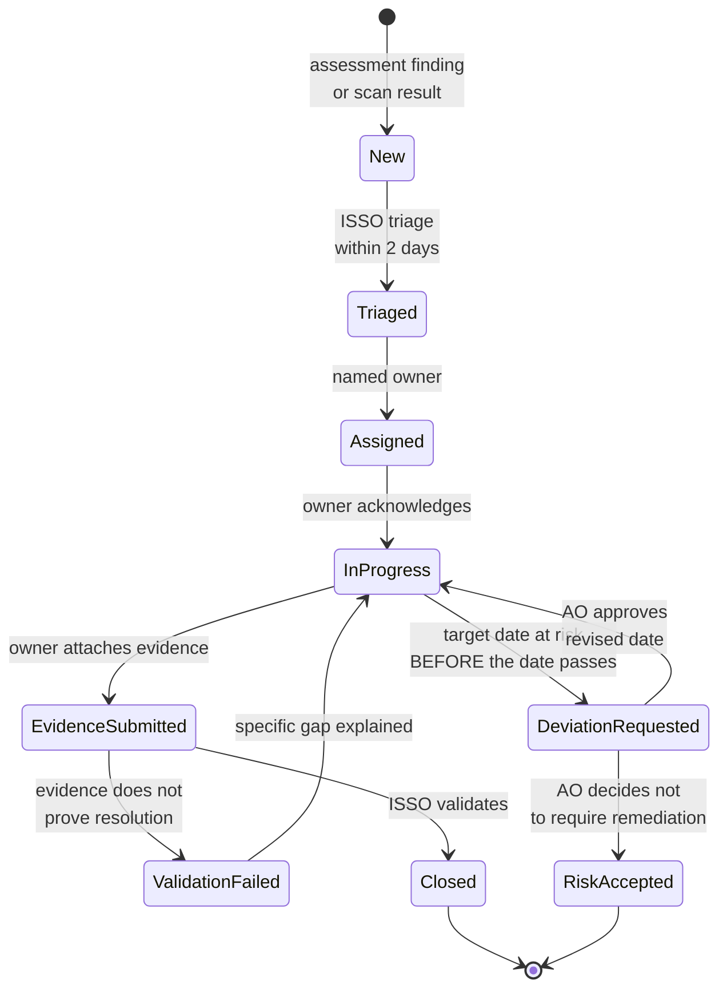

# CM-03: POA&M Lifecycle in ServiceNow
### Keystone Grants Management System (KGMS) | States, assignment, evidence validation and deviation requests

> ### PORTFOLIO EXERCISE, SIMULATED SYSTEM
> **Keystone Grants Management System (KGMS) does not exist.** The Federal Workforce Development Agency (FWDA) is a fictional federal
> agency invented for this portfolio. Every organisation, person, system
> identifier, network address, finding, date and signature on this page is
> fabricated for training purposes, with one exception: the author, Nkeiru Sarah Adesida, is a real person. Where her name appears in a scenario role, that role is fictional, and she has never worked for this agency, which does not exist. Nothing here is drawn from any real
> employer, client or government system, and no real document, artifact or
> data has been reproduced. This file is coursework, not a government record.

---

**Document:** POA&M Management Lifecycle and Workflow  
**Simulated system:** Keystone Grants Management System (KGMS) | `FWDA-KGMS-2026-MOD`  
**Framework and standards:** NIST SP 800-37 Rev 2, OMB Circular A-130, FedRAMP POA&M requirements  
**Author:** Nkeiru Sarah Adesida  
**Document date:** 31 August 2026  
**Status:** Complete

**Navigation:** [<- CM-02: Vulnerability Management Programme](../cm-02-vulnerability-management/README.md) &nbsp;|&nbsp; [Repository home](../README.md) &nbsp;|&nbsp; [CM-04: Control Monitoring in RSA Archer ->](../cm-04-archer-control-monitoring/README.md)

---

## Purpose

A Plan of Action and Milestones is only as good as the workflow behind it. This document is
how POA&M items are actually worked, in ServiceNow, from creation to validated closure.

Plain language version: the POA&M is the list of things still wrong. This is the conveyor
belt that moves an item along that list: who picks it up, what they have to prove before it
comes off the list, and what happens when the date is going to be missed.

---

## Section 1: Why a workflow tool rather than a spreadsheet

A POA&M is often maintained as a spreadsheet, and for a small system that works. It stops
working for four specific reasons, and each one is a failure mode worth naming:

1. **No assignment.** A spreadsheet cell containing a person's name does not notify that
   person or appear in their work queue. An item nobody is told about is an item nobody
   works.
2. **No history.** When a target date moves from June to September, a spreadsheet shows
   September. It does not show that the date moved, when, or who changed it. That history is
   exactly what an auditor asks for.
3. **No evidence attachment.** Evidence ends up in a shared folder, in an email, or in
   somebody's screenshots directory. At the annual assessment it cannot be found, so the
   control is unevidenced and therefore, to the assessor, unperformed.
4. **Silent editing.** Anyone can change a severity rating or a date with no record. The
   most dangerous version of this is not malice, it is an owner quietly downgrading a
   severity because the deadline is uncomfortable.

The workflow tool exists to make each of those four things impossible rather than
discouraged.

---

## Section 2: States

| State | Meaning | Exit condition | Required evidence |
|---|---|---|---|
| New | Created from an assessment finding or a scan result. Not yet triaged | ISSO triages within 2 business days | Source reference, control, initial severity |
| Triaged | Severity confirmed, control mapped, service level applied, owner identified | Assignment to a named individual | Triage note, severity rationale |
| Assigned | A named person owns it. Not a group, not a queue | Owner acknowledges within 3 business days | Assignment record, acknowledgement |
| In progress | Work under way against defined milestones | Milestone updates at least monthly | Milestone completion records |
| Evidence submitted | Owner believes it is done and has attached evidence | ISSO validates. This is a review gate, not a formality | Evidence artifacts |
| Validation failed | Evidence does not prove the finding is resolved. Returns to In progress with a reason | Owner addresses the specific gap | Validation note explaining what was insufficient |
| Closed | ISSO has validated that the evidence resolves the finding as written | Evidence archived to RSA Archer for the retention period | Closure record, validated evidence |
| Deviation requested | Target date at risk. Submitted to the AO before the date passes, with a justification and a revised date | AO approves or rejects | Deviation request, AO decision |
| Risk accepted | The AO has decided not to require remediation. Rare, and it is a decision not a state of neglect | Reviewed at each annual assessment | Signed risk acceptance |

### The two states that make this workflow real

**Evidence submitted and Validation failed.** Most POA&M processes have no validation gate:
the owner marks the item complete and it closes. That means closure records the owner's
belief, not the resolution of the finding.

With a validation gate, the ISSO reads the evidence against the finding text and asks one
question: **does this artifact prove the thing the finding said was wrong is no longer
wrong?** Three real examples of evidence that fails that question:

- A screenshot of a patched host, where the finding covered four hosts.
- A policy document, where the finding was that the policy was not followed.
- A statement that training was completed, where the finding required the completion
  records.

Each of those is offered in good faith and none of them closes the finding. Returning an
item with a specific explanation of what is missing is not bureaucracy; it is the only
reason a closure record means anything.

---

## Section 3: Workflow

---

## Section 4: Record structure

| Field | Why it exists |
|---|---|
| POA&M identifier | Stable reference cited in the authorisation package and every monthly report |
| Source reference | The assessment finding or scan finding it came from. An item with no source is an item nobody can justify |
| Control identifier | Which NIST control the weakness sits under. Drives the control level reporting in RSA Archer |
| Weakness description | What is wrong, written so somebody outside the team can understand it |
| Risk rating | High, Moderate or Low. Changing it requires a documented reason and is visible in history |
| Affected assets | The list, not a count. One weakness across four hosts is one item with four assets |
| Owner | A named individual. Not a team, not a queue, not a manager |
| Original target date | Never overwritten. Preserved so slippage is visible |
| Current target date | Changes only through an approved deviation request |
| Milestones | Interim steps with dates, so progress is measurable before completion |
| Evidence attachments | Attached to the record, not stored elsewhere |
| Validation note | What the ISSO checked and concluded |
| Compensating controls | What reduces risk while the item is open. This is what the AO reads when deciding whether to accept an open High item |
| History | Every state change and field change, with who and when. Not editable |

### The field that does the most work

**Original target date, never overwritten.** If the current date is the only date stored,
an item that slipped three times looks identical to an item that was always due in
December. Keeping both makes slippage a fact rather than a memory, and a POA&M where
slippage is invisible is a POA&M that will slip.

---

## Section 5: Deviation requests

A deviation request is what you file when a target date is going to be missed. Filed
**before** the date, it is risk management. Filed after, it is an explanation.

| Required element | Why the AO needs it |
|---|---|
| The original commitment and the date | Establishes what is being changed |
| Current progress against milestones | Distinguishes a stalled item from a delayed one, which are different problems |
| Why the date cannot be met | A specific reason. Resource contention, a dependency, a procurement cycle, a required outage window |
| Proposed revised date, with a basis | A date derived from the actual constraint, not a comfortable guess |
| Compensating controls in the meantime | What limits the exposure during the extension. This is usually the deciding factor |
| Consequence of rejection | What would have to be dropped to hit the original date, so the AO is making a real trade rather than a nominal one |

### Worked example from this system

POA-005, the contingency plan functional restore test, was at risk in July 2026 because the
System Owner could not secure an outage window before the September award cycle.

What was filed: the original date of 30 September 2026, progress showing the plan already
updated on 28 July, the specific constraint of an outage window conflicting with the award
cycle, a proposed date, the compensating controls of nightly backups verified as running
and cross region replication confirmed, and the honest statement that the recovery time
objective would remain unverified until the test ran.

What the AO did at the management review: **declined to accept a tabletop exercise as a
substitute.** A tabletop cannot measure a recovery time, so accepting one would have closed
the item without answering the question the item exists to answer.

That is the right outcome and it is worth recording, because the tempting outcome was to
accept the tabletop, close the item, and report a clean POA&M.

---

## Section 6: Anti patterns

Six ways a POA&M becomes decorative. Each has been seen in real programmes.

| Anti pattern | Why it is damaging | Control against it |
|---|---|---|
| Items assigned to a team rather than a person | Nobody is accountable and nothing moves | Assignment requires an individual |
| Closure on the owner's assertion | Closure records belief rather than resolution | ISSO validation gate |
| Severity quietly downgraded as a deadline approaches | Reduces the apparent problem without reducing the risk | Severity changes require a reason and are visible in history |
| Target dates overwritten rather than revised | Slippage becomes invisible | Original date preserved, changes only via deviation request |
| One weakness split across many items to show progress | Closing 3 of 4 items looks like progress when the weakness is still present | Deduplication at triage: one weakness, one item, many assets |
| Assessment findings that never reach the POA&M | The AO accepts risk they were never told about | Reconciliation check: findings minus closed minus accepted must equal open POA&M items |

The last one is the most serious, and it is the easiest to detect. In the authorisation
package for this system: 16 findings, 5 closed during
fieldwork, 1 risk accepted, 10 carried to the POA&M.
5 plus 1 plus 10 equals
16. That subtraction takes ten seconds and it is the first thing a reviewer
should do.

---

**Navigation:** [<- CM-02: Vulnerability Management Programme](../cm-02-vulnerability-management/README.md) &nbsp;|&nbsp; [Repository home](../README.md) &nbsp;|&nbsp; [CM-04: Control Monitoring in RSA Archer ->](../cm-04-archer-control-monitoring/README.md)

---

*Author: Nkeiru Sarah Adesida, Information System Security Officer (ISSO), portfolio scenario*  
*Simulated system: Keystone Grants Management System (KGMS) | FWDA-KGMS-2026-MOD*  
*This document is a portfolio exercise built on a fictional organisation. It is not a government record.*  
*[GitHub portfolio](https://github.com/Nkee07) | [LinkedIn](https://www.linkedin.com/in/nkeiru-adesida-grc)*
